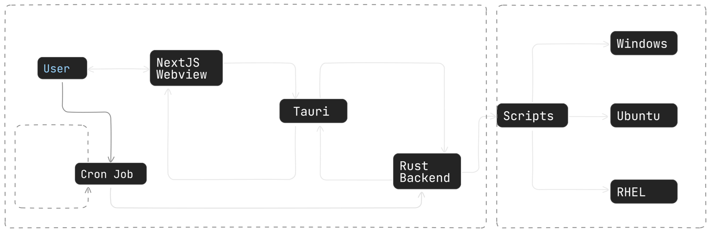

# Smart India Hackathon 2024

A brief description of your project and its purpose. Mention the problem it solves and its significance.

## Table of Contents

- Introduction
- Features
- Tech Stack
- Installation
- Usage
- Contributors
- License
- Acknowledgements

## Introduction

- Problem Statement ID – `1679`
- Problem Statement Title- `Development of Audit script for Windows 11 and Linux OS as per CIS (Centre for Internet Security) bench mark`
- Theme - `Blockchain and Cybersecurity`
- PS Category - `Software`
- Team ID - **_None_**
- Team Name - `Ctrl-Crew`

### Developing an Audit Script according to CIS benchmarks with an easy to use Cross-Platform GUI

- This cross-platform application enables users and admins to perform
  Security Audits according to the CIS Benchmarks in Windows 11/ Ubuntu
  22.04 LTS / RHEL systems and their server counterparts .
- The application supports both standalone and admin-triggered audit
  executions. In both scenarios, audit reports and logs are stored locally, with
  the admin-triggered mode additionally transmitting these artifacts to the
  Admin System for centralized review.
- These Bash/PowerShell scripts are executed concurrently, leveraging multi
  core architecture to check and validate multiple benchmarks
  simultaneously, achieving high-speed audits. The generated reports
  accurately reflect the machine's security posture in accordance with CIS
  Benchmarks.

### Tech Stack

_Framework_

- Tauri

_Backend_

- Rust

_Frontend_

- NextJS

### Application Architecture Design

### Website design: [View Figma Design](https://www.figma.com/design/Rv4sr97vO1Dta34Mofi1Kg/SIH-Figma?node-id=0-1&t=K6KypJJLI4CRrAxZ-0)
